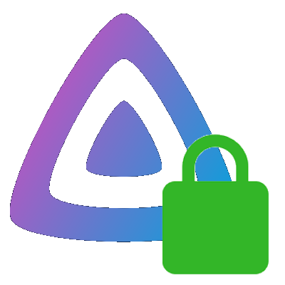

<!-- PROJECT LOGO -->
 

  

  <h3 align="center">JF-secure</h3>

  

    A tool stack to automatically reverse proxy Jellyfin
     
    <a href="https://github.com/dab2020/JF-secure/issues">Report Bug</a>
    ·
    <a href="https://github.com/dab2020/JF-secure/issues">Request Feature</a>
  

<!-- TABLE OF CONTENTS -->

  
<h2 style="display: inline-block">Table of Contents</h2>

  <ol>
    <li>
      <a href="#about-the-project">About The Project</a>
      <ul>
        <li><a href="#built-with">Built With</a></li>
      </ul>
    </li>
    <li>
      <a href="#getting-started">Getting Started</a>
      <ul>
        <li><a href="#prerequisites">Prerequisites</a></li>
        <li><a href="#installation">Installation</a></li>
      </ul>
    </li>
    <li><a href="#usage">Usage</a></li>
    <li><a href="#roadmap">Roadmap</a></li>
    <li><a href="#contributing">Contributing</a></li>
    <li><a href="#license">License</a></li>
    <li><a href="#contact">Contact</a></li>
    <li><a href="#acknowledgements">Acknowledgements</a></li>
  </ol>

<!-- ABOUT THE PROJECT -->
## About The Project

There are many great reverse-proxy tools available on GitHub, however, I didn't find one that really suit my needs and was user friendly for beginner users, so I decided to take open source software like [Caddy Web-server](https://github.com/caddyserver/caddy) and [WinSSW](https://github.com/winsw/winsw) to create a tool stack that will reverse-proxy Jellyfin for you. I wanted it to be automated and easy to use, even for novice users.

### Built With

* Visual Basic .NET Framework (4.8)
* [WinSSW](https://github.com/winsw/winsw)
* [Caddy Webserver](https://github.com/caddyserver/caddy)

<!-- GETTING STARTED -->
## Getting Started

To get a local copy up and running follow these simple steps.
Clone the repo and enter the JF-Secure RW directory from there open up the Visual Studio (2022) Solution

### Prerequisites
* A Custom Domain (Ideally using Dynamic DNS)
* Port 80 & 443 forwarded to the Server
* Exemption in the firewall for port 80 & 443
* Remote access allowed in Jellyfin

### Installation
1. Download the latest release
2. Run the installer
3. Click the shortcut on the desktop
4. The Program will ask some questions i.e. domain and address of the Jellyfin Server.
6. The Program will perform some background Tasks and then You are all set to go. That may require Admin Privelieges, Click yes to allow those.
7. The service automatically starts in the background upon system start.

### Uninstalling
1. Open up JF-Secure
2. When Prompted enter 2 (The option for uninstalling Service)
3. Close the Program
4. Run the Uninstaller

### Manually Creating a Backup
As of now the BackUp Create Function is flawed so you need to create a manual backup
1. Enter the Install Directory of JF-Secure
2. Find the Caddyfile
3. Copy it to your desired destination
4. Rename it to backup.jfsbk
You can now use this to restore your Installation

<!-- USAGE EXAMPLES -->
## Usage

1. To reverse-proxy Jellyfin
2. To enable remote-access
3. If you change the port and address when prompted for the address of the Jellyfin Server, you can also reverse proxy other services, however additional configuration will be required and I will not be able to help you in Troubleshooting

<!-- ROADMAP -->
## Roadmap

See the [open issues](https://github.com/dab2020/JF-secure/issues) for a list of proposed features (and known issues).

<!-- CONTRIBUTING -->
## Contributing

Contributions are what make the open source community such an amazing place to be learn, inspire, and create. Any contributions you make are **greatly appreciated**.

1. Fork the Project
2. Create your Feature Branch (`git checkout -b feature/AmazingFeature`)
3. Commit your Changes (`git commit -m 'Add some AmazingFeature'`)
4. Push to the Branch (`git push origin feature/AmazingFeature`)
5. Open a Pull Request

<!-- CONTACT -->
## Contact

Dayyan Abdullah - contact@dayyanabdullah.tech
<b>Please don't contact me  for useless stuff like Technical Support and issues, for those open a Github issue.

Project Link: [https://github.com/dab2020/JF-secure](https://github.com/dab2020/JF-secure)

<!-- MARKDOWN LINKS & IMAGES -->
<!-- https://www.markdownguide.org/basic-syntax/#reference-style-links -->
[contributors-shield]: https://img.shields.io/github/contributors/github_username/repo.svg?style=for-the-badge
[contributors-url]: https://github.com/github_username/repo/graphs/contributors
[forks-shield]: https://img.shields.io/github/forks/github_username/repo.svg?style=for-the-badge
[forks-url]: https://github.com/github_username/repo/network/members
[stars-shield]: https://img.shields.io/github/stars/github_username/repo.svg?style=for-the-badge
[stars-url]: https://github.com/github_username/repo/stargazers
[issues-shield]: https://img.shields.io/github/issues/github_username/repo.svg?style=for-the-badge
[issues-url]: https://github.com/github_username/repo/issues
[license-shield]: https://img.shields.io/github/license/github_username/repo.svg?style=for-the-badge
[license-url]: https://github.com/github_username/repo/blob/master/LICENSE.txt
[linkedin-shield]: https://img.shields.io/badge/-LinkedIn-black.svg?style=for-the-badge&logo=linkedin&colorB=555
[linkedin-url]: https://linkedin.com/in/github_username
